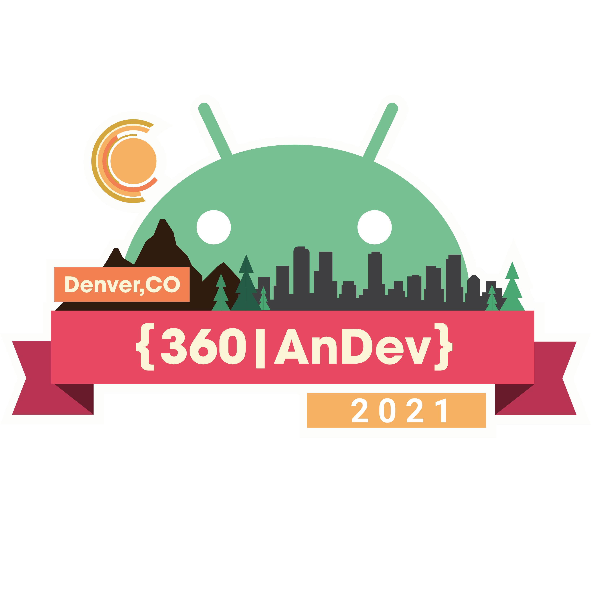

autoscale: true
build-lists: true
slidenumbers: true
theme: Fira, 2
list: alignment(left)



---

## Gradle Isn't Just a
# Bad Word
# 🤬

^
https://360andev.com/session/gradle-isnt-just-a-bad-word/

---

# Agenda 🗓

- 🏛 Project Structure
- ⌨️ Invoking Gradle from the CLI
- ✅ Creating Tasks
- 🔌 Plugins
- 👩‍👩‍👧‍👦 Dependencies
- 🧱 Composite Projects

---

# Gradle Project Structure

- Wrapper
- File Layout
- Project Hierarchy

---

## Rapper?


---

## Wrapper

```
└─── gradle
│   └── wrapper
│       └── gradle-wrapper.jar
│       └── gradle-wrapper.properties
├── gradlew
└── gradlew.bat
```

---

## Invoking the Wrapper

- `./gradlew taskName`
- `gradlew.bat taskName`

^
Task names can be partial; the minimum of the camel-case letters to uniquely identify the task

---

# Wrapper Function (Bash & Z Shell)

```
function gw {
    if [ -e ./gradlew ]; then
        ./gradlew $argv
        return
    fi

    echo "There is no Gradle wrapper in the current dir."
    gradle $argv
}
```
---

# Wrapper Function (Fish Shell)

```
function gw
    if test -e ./gradlew
        ./gradlew $argv
        return
    end

    echo "There is no Gradle wrapper in the current dir."
    gradle $argv
end
```

---

## Project Hierarchy

```
Root project 'CompositeProject'
+--- Project ':app'
\--- Project ':module'
```


^
Gradle uses semicolon as Hierarchy notation
a single semicolon references the "root" project in a multi-project

---

## Files

- build.gradle
- settings.gradle
- gradle.properties

---

## Android/Gradle Scripts

```
.
├── app
│   └── build.gradle
├── build.gradle
├── gradle.properties
├── local.properties
├── module
│   └── build.gradle
└── settings.gradle
```

---

Invoking Gradle from the CLI

---

## Input

- build.gradle
- gradle.properties
- ~/.gradle/gradle.properties
- -Pproperty=value

---

## Output

- console
- log levels
- stacktrace
- build scans

---

# Tasks

- tasks
- tasks --all

---

## Creating Tasks

- doLast

## dependsOn
## Dry Run

--dry-run
-m

---

# Plugins
## Buildscript
## Plugins Block
## Maven Coordinates vs Plugin ID

---

# Dependencies
## Implementation, Api and Compile

---

# Composite Projects
