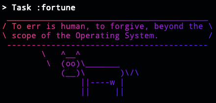
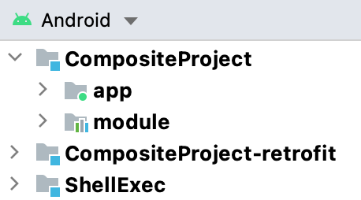

autoscale: true
build-lists: true
slidenumbers: false
theme: Fira, 2
list: alignment(left)
[.footer-style: alignment(right)]


---

## Gradle Isn't Just a
# Bad Word
# 🤬

^
Inspired by my Mobile DevOps experience supporting Android developers
and building gradle plugins

---


^
The way Android devs use the word "gradle" it sounds like profanity
only hear it when their build breaks.

---

# Goals 🎯

- reduce fear of Gradle
- help you understand Stack Overflow snippets
- new tools to help debug builds

^
to help you understand what's going under the covers of Android Studio,
use gradle directly on the command line in a Terminal window

---

## github.com/phatblat/CompositeProject

^
I've worked up a companion project for this talk
My bot will paste that URL into Slack

---

# Agenda 🗓

- 🏛 Project Structure
- ⌨️ Invoking Gradle from the CLI
- ✅ Creating Tasks
- 🔌 Plugins
- 👩‍👩‍👧‍👦 Dependencies
- 🧱 Composite Projects

^
Composite projects are a neat trick for debugging and/or modifying a dependency
while testing it inside your app!

---

# Files

---

# Gradle Project Structure

- Wrapper
- Ignore
- File Layout
- Project Hierarchy

^
First, the rapper

---

## Rapper?


^
no, not that kind of rapper

---

# Wrapper

```
└─── gradle
│   └── wrapper
│       └── gradle-wrapper.jar
│       └── gradle-wrapper.properties
├── gradlew
└── gradlew.bat
```

^
no need to install gradle
wrapper pins version of gradle in your project
check these files into git

---

# Ignore

- .gradle/
- build/

^
No preceding slash will ignore all build dirs

---

# Gradle Files

- build.gradle
- settings.gradle
- gradle.properties

^
Groovy plus a custom DSL
can put any valid groovy or java in a .gradle file, provided the DSL syntax allows

---

# Kotlin Script

- build.gradle.kts
- settings.gradle.kts

^
Don't use it; don't feel bad if you aren't
Kotlin script hasn't been very well supported by Android Studio
Most sample Gradle build scripts will be in Groovy

---

# build.gradle

- gradle DSL
- plugin "extension" DSLs

---

# settings.gradle

- rootProject.name
- multi-project configuration (`include`)
- composite configuration (`includeBuild`)

^
Only place root project name can be tailored. Defaults to folder name

---

# gradle.properties

- Comment lines with `#`
- Leading/trailing whitespace ignored `key = value`
- Values read as `String`
- Properties inherited by subprojects
  - AGP 4.2+ ignores these files in subprojects [^1]

[^1]: See the AGP 4.2 [release notes](https://developer.android.com/studio/releases/gradle-plugin)

^
Java properties syntax
Need special handling for Integers
Properties defined in the root project are visible in subprojects, but can be overridden
Causes confusion where to put values

---

## local.properties

- `sdk.dir`
- `ndk.dir`

^
Only used by AGP for a few dir values

---

## Project Hierarchy

```
Root project 'CompositeProject'
+--- Project ':app'
\--- Project ':module'
```

View using the "projects" task.

^
Each line lists a gradle project within a multi-project setup.
Every Android project is a multi-project where the root is just for configuration.
Gradle uses semicolon as Hierarchy notation
a single semicolon references the "root" project in a multi-project

---

# Invoking Gradle from the CLI

---

## Invoking the Wrapper

- `./gradlew taskName`
- `gradlew.bat taskName`
- `gw taskName`

^
Always run from root of the repo.
./ is needed on unix since the current dir is not on the PATH

---

# Wrapper Function (Bash & Z Shell)

```
function gw {
    if [ -e ./gradlew ]; then
        ./gradlew $argv
        return
    fi

    echo "There is no Gradle wrapper in the current dir."
    gradle $argv
}
```

[.footer: ~/.bashrc or ~/.zshrc]

^
Put this in your .bashrc or .zshrc

---

# Wrapper Function (Fish Shell)

```
function gw
    if test -e ./gradlew
        ./gradlew $argv
        return
    end

    echo "There is no Gradle wrapper in the current dir."
    gradle $argv
end
```

[.footer: ~/.config/fish/functions/[gw.fish](https://github.com/phatblat/dotfiles/blob/master/.config/fish/functions/gw.fish)]

---

## Input

- build.gradle
- gradle.properties
- ~/.gradle/gradle.properties
- -Pproperty=value

---

## Output

- console
- log levels
- stacktrace
- build scans

^
Options to control output

---

## --console

-
- `plain`

---

## Log Levels

- error: -q, --quiet
- warn: -w, --warn
- lifecycle (default)
- -i, --info
- -d, --debug

^
debug can include sensitive info

---

## Stack Trace

- -s, --stacktrace
- -S, --full-stacktrace

^
Print out the full (very verbose) stacktrace for all exceptions.

---

## Build --scan

--scan

^
Creates a sharable web report

---

# Tasks

---

# Listing Tasks

- `gw tasks`
- `gw tasks --all`


^
without --all only dasks which have a "group" are shown
the group name is "zzz"

---

# Creating Tasks

```
tasks.register('hello') {
    doLast {
        println 'hello world'
    }
}
```

^
Goes in build.gradle
doLast is the task action

---

# Example Tasks

- buildTypes
- productFlavors
- flavorDimensions
- buildVariants
- variantFilter

^
companion project includes some simple gradle tasks
along with some more advanced ones

---

# ShellExec

```
tasks.register('fortune', ShellExec) {
    command "fortune | cowsay | lolcat --force"
}
```



^
Gradle plugin to replace Exec
Supports any Bash syntax in the command string

---

# dependsOn

- Chains tasks

```
🙅🏻‍♀️ assembleDebug.dependOn(fortune)

tasks.whenTaskAdded { task ->
    if (task.name == 'assembleDebug') {
        task.dependsOn(fortune)
    }
}
```

^
Task graph is a DAG. After tree/graph is built, then task order is determined
Not intuitive

---

# Dry Run

- -m, --dry-run

```
↪ gw --dry-run assembleDebug
:fortune SKIPPED
:app:preBuild SKIPPED
...
:app:packageFullDebug SKIPPED
:app:assembleFullDebug SKIPPED
:app:assembleDebug SKIPPED
..
:module:compileDebugSources SKIPPED
:module:assembleDebug SKIPPED
```

---

# Plugins

---

# Script Plugins

```
apply from: "android-info.gradle"
```

- File path
- ~~URL~~

^
Simple way to split up your build.gradle
Remote scripts can be applied with an HTTP URL, but that's a terrible idea

---

# Binary Plugins

- Buildscript Block
- Plugins Block
- Maven Coordinates vs Plugin ID

^
Plugins extend the Gradle DSL (android) block, add tasks

---

## Buildscript Block

```
buildscript {
    repositories {
        google()
        mavenCentral()
        jcenter()
    }
    dependencies {
        classpath 'at.phatbl:shellexec:+'
    }
}

apply plugin: "at.phatbl.shellexec"
```

^
only in root project
dependencies (plugins) always use "classpath"

---

# Plugins Block

```
plugins {
  id "at.phatbl.shellexec" version "1.5.2"
}
```

- version only needed in root project
- auto-applies plugin to the current project
  - opt out with: `apply false`

^
Android Studio 4.2 uses plugins block in subprojects/modules

---

# Maven Coordinates

- group ID
- artifact ID
- version
- classifier (optional)
- extension (optional)

```
configurationName 'group:name:version:classifier@extension'
configurationName group: group, name: name, version: version, classifier: classifier, ext: extension
```

^
components separated by colon
except extension is prefixed with @
double quotes required if using a variable

---

# Maven Group ID

- typically reverse-domain syntax of author
- phatbl.at <-> at.phatbl
- org.jetbrains.kotlin
- com.android.tools.build

^
authors with lots of published libraries may use many groups

---

# Maven Artifact ID

- library name
- typically words separated by dash
  - e.g. `protobuf-gradle-plugin`

---

# Version

- Semantic verion number
- Rolling `-SNAPSHOT`s
- Optional pre-release qualifier (e.g. 1.0-alpha-3)

---

# Specifying versions

- Support for version ranges [^2]
- Dynamic versions (`+`)

[^2]: Maven Dependency [Version Requirement Spec](https://maven.apache.org/pom.html#dependency-version-requirement-specification)

^
Version ranges probably only useful for libraries.

---

# Dynamic Versions

- `+` - any version
- `1.+` - any v1 minor version
- `1.2.+` - any v1.2 patch version
- Version cached for 24h
  - Force check with `--refresh-dependencies`

^
Gradle feature, not maven
Gradle has dependency locking, but I haven't used it

---

# Dynamic Version Caveats

- Discouraged by Google
- Build non-determinism if dependency updates are being released
- Slower dependency resolution
  - Every repo is checked for dependency versions

^
Every repo in list is searched, even after match is found
Google moved plugin from jcenter to their own repo
builds failed if jcenter listed before google

---

# Plugin ID

- Used when applying plugins
- Used in newer Gradle `plugins` block

---

## Maven Coordinates vs Plugin ID

- `at.phatbl:shellexec:1.0.0`
- `at.phatbl.shellexec`
- View on plugins.gradle.org for most plugins

^
AGP published to google's maven repo

---

# Dependencies

---

# Configuration

- compile (don't use)
- implementation (use this)

```
implementation ...
testImplementation ...
```

^
configuration is a group of dependencies
compile removed in Gradle 7

---

# Configuration

- api - for modules & libraries
  - when types defined in a dependency are exposed by your public API
  - see app -> module.GitHub -> retrofit in example project

---

# List Plugins

```
↪ gw buildEnvironment

classpath
+--- com.android.application:com.android.application.gradle.plugin:4.2.2
|    \--- com.android.tools.build:gradle:4.2.2
|    ...
\--- at.phatbl.shellexec:at.phatbl.shellexec.gradle.plugin:1.5.2
     \--- gradle.plugin.at.phatbl:shellexec:1.5.2
          +--- org.jetbrains.kotlin:kotlin-stdlib:1.3.61 -> 1.5.21 (*)
          +--- org.jetbrains.kotlin:kotlin-stdlib-jdk8:1.3.61 -> 1.4.31 (*)
          \--- org.jetbrains.kotlin:kotlin-reflect:1.3.61 -> 1.5.21 (*)
```

---

# Gradle Dependencies Task

```
↪ gw :app:dependencies --configuration implementation

implementation - Implementation only dependencies for 'main' sources. (n)
+--- project module (n)
+--- org.jetbrains.kotlin:kotlin-stdlib:1.5.21 (n)
+--- androidx.core:core-ktx:1.6.0 (n)
+--- androidx.appcompat:appcompat:1.3.0 (n)
+--- com.google.android.material:material:1.4.0 (n)
\--- androidx.constraintlayout:constraintlayout:2.0.4 (n)
```

---

# Android Dependencies Task

```
↪ gw androidDependencies

releaseUnitTestRuntimeClasspath - Dependencies for runtime/packaging
+--- :module (variant: release)
+--- junit:junit:4.13.2@jar
+--- com.squareup.retrofit2:converter-gson:2.9.0@jar
+--- com.squareup.retrofit2:adapter-java8:2.9.0@jar
+--- com.squareup.retrofit2:retrofit:2.9.0@jar
+--- androidx.core:core-ktx:1.6.0@aar
+--- com.google.code.gson:gson:2.8.5@jar
\--- com.squareup.okio:okio:1.17.2@jar
```

---

# Composite Project



gw --include-build ../retrofit ...

^
Gradle has a CLI option to configure a composite project build

---

# includeBuild

```
File retrofitProject = file("../retrofit")

includeBuild(retrofitProject) {
    dependencySubstitution {
        substitute module('com.squareup.retrofit2:retrofit') with project(':retrofit')
    }
}
```

^
Java file reference to root of build to include
dependencySubstitution
Tells gradle to substitute the dependency with the given project

---

# Sample Project

```
↪ gw clonePlugin cloneRetrofit

> Task :clonePlugin
Cloning into '../ShellExec'...

> Task :cloneRetrofit
Cloning into '../retrofit'...
```

---

# Sample Project

```
↪ gw projects
Including .../ShellExec project in composite build.
Including .../retrofit project in composite build.

> Configure project :ShellExec
...

> Configure project :retrofit:retrofit
...
```

---

# Caveats

- AGP version
- Android build variants
- Gradle plugin using same library

---

# AGP Version

```
> Failed to apply plugin 'com.android.internal.application'.
   > Using multiple versions of the Android Gradle plugin in the same build is not allowed.
     - Project `.../CompositeProject/app` is using version `4.2.2`
     - Project `.../retrofit/retrofit/android-test` is using version `4.2.1`
```

---

# Gradle Properties to the Rescue! 💪🏻

gw -P**agp_version**=4.2.1 projects

`> Configure project :retrofit:retrofit`

^
Once you verify that this works on the CLI, update the property and sync Android Studio

---

# Variants

Comment out:

- flavorDimensions
- productFlavors

^
If you have problems
couldn't reproduce

---

# Gradle plugin using same library

- `includeBuild file("../retrofit")`

```
> Could not resolve com.squareup.retrofit2:retrofit:2.7.1.
    Required by:
        project :retrofit > com.vanniktech:gradle-maven-publish-plugin:0.14.0
        project :retrofit > com.vanniktech:gradle-maven-publish-plugin:0.14.0 > com.squareup.retrofit2:converter-moshi:2.7.1
```

- Removed the gradle-maven-publish-plugin from retrofit

---

# Problem

^
If I've been successful, then we have a problem.
You've just lost a bad word from your vocabulary.

---

# Profanity 🤬

- frak
- p'tak
- frell
- cruk
- shazbot
- kriff
- gorram

^
https://gizmodo.com/10-scifi-curse-words-for-all-occasions-1792827239

---


